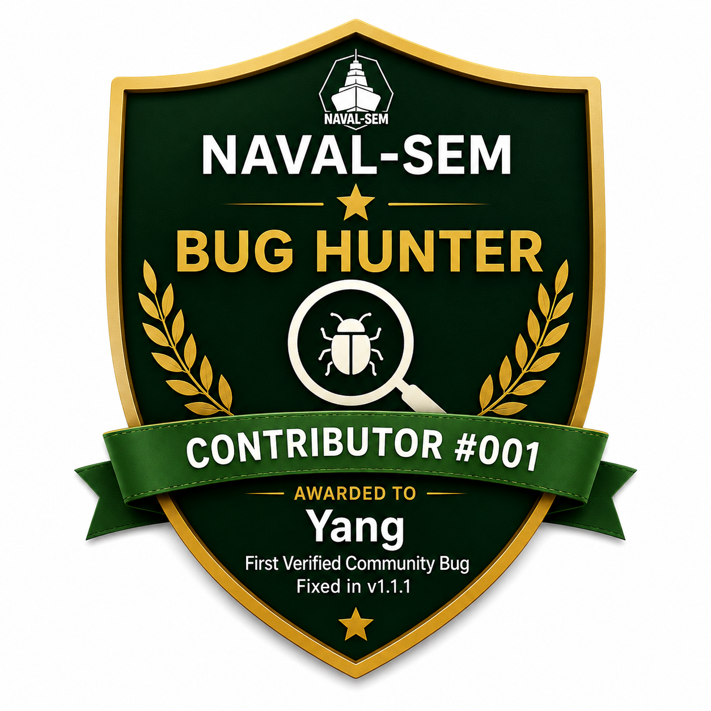

# Contributing to NAVAL-SEM

Thank you for your interest in NAVAL-SEM.

NAVAL-SEM is an offline desktop application for Structural Equation Modelling (SEM), supporting both PLS-SEM and CB-SEM workflows with a visual model builder and reproducible code export.

The project is currently maintained by a single independent developer and contributions, bug reports, and feedback are welcome.

---

# Ways to contribute

You can help by:

- Reporting bugs
- Suggesting features
- Improving documentation
- Testing releases on different operating systems
- Improving UI/UX
- Validating statistical outputs
- Contributing tutorials or demo datasets

---

# Before opening issues

Please:

- Check existing issues first
- Include screenshots or logs when possible
- Mention:
  - operating system
  - NAVAL-SEM version
  - dataset type (CSV / Excel / SPSS)

---

# Development setup

Clone the repository:

    git clone https://github.com/navalsingh9/naval-sem.git
    cd naval-sem

Install dependencies (creates `.venv` automatically):

    uv sync

Run locally:

    uv run launcher.py

No `uv`? [Install it](https://docs.astral.sh/uv/getting-started/installation/) first — it keeps everyone's environment identical via `uv.lock`.

---

# Build instructions

Windows EXE/MSI, macOS DMG, and the Linux binary/.deb are built automatically by GitHub Actions (`.github/workflows/release.yml`) on every `v*.*.*` tag push — you shouldn't need to build these locally.

If you want to test a Linux package build on your own machine:

    bash build_linux.sh

---

# Coding guidelines

Please try to:

- Keep code readable and modular
- Avoid unnecessary dependencies
- Preserve offline-first behaviour
- Keep UI responsive
- Add comments where statistical logic may not be obvious

---

# Statistical validation

SEM implementations can differ subtly across tools.

If contributing to:
- estimation
- fit statistics
- bootstrapping
- HTMT
- missing data handling

please include references, equations, papers, or comparisons where possible.

---

# Security

NAVAL-SEM is designed as an offline-first desktop application.

Please responsibly disclose any security-related concerns instead of posting them publicly.

See:

SECURITY.md

---

# 🏆 Community Recognition

NAVAL-SEM is an open-source research project, and every meaningful contribution helps improve the software for researchers worldwide.

Outstanding contributors are recognized here.

## 🥇 Bug Hunter #001

**Yang**

🇰🇷 South Korea

Contribution:
- First verified community bug report

Issue:
- Builder "Draw Arrow" regression

Resolved in:
- NAVAL-SEM v1.1.1

Thank you for helping make NAVAL-SEM better for everyone.

---

Future contributors may be recognized here for significant bug reports, feature contributions, testing, documentation, or community support.

# Project status

NAVAL-SEM is under active development and APIs/UI behaviour may evolve rapidly during early releases.

Feedback from:
- PhD scholars
- researchers
- faculty
- quantitative analysts
- SEM practitioners

is especially valuable.

---

Thank you for helping improve accessible SEM tooling.
